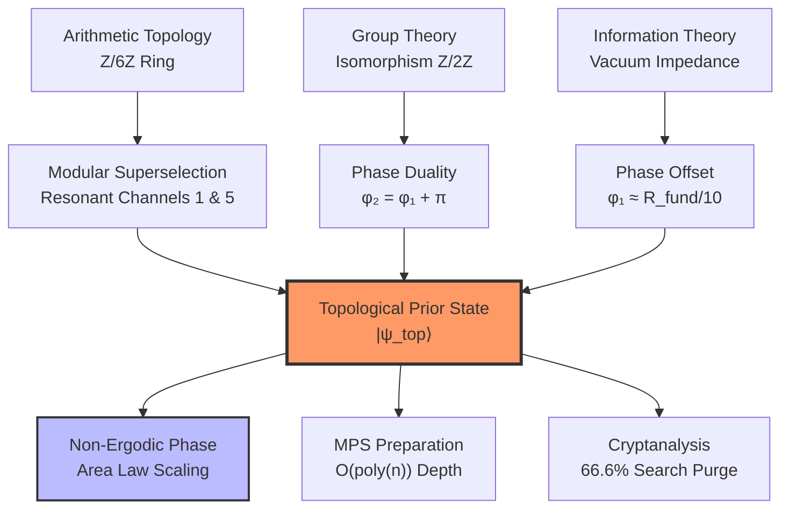

# 🌀 Phase-Pi-Quantum-Prior

### Analytical Phase Origins and $\mathbb{Z}/6\mathbb{Z}$ Topological Superselection for NISQ State Preparation
[](https://github.com/NachoPeinador/Z6Z-Riemann-Spectrum/blob/main/README_es.md)
[](https://www.python.org/)
[](https://doi.org/10.5281/zenodo.xxxxxxxx)
[](https://orcid.org/0009-0008-1822-3452)
[](https://twitter.com/todos_lumpen)
[](https://github.com/NachoPeinador/Z6Z-Riemann-Spectrum/blob/main/Papers/Z6Z_EHH_paper.pdf)
---

## 🎯 TL;DR – The Essentials

### 🔬 **Theoretical Breakthroughs**

* 📐 **Analytical Phase Discovery:** Proof that the optimal initialization phases ($\phi_1, \phi_2$) are not heuristic, but emerge from the unit group isomorphism $(\mathbb{Z}/6\mathbb{Z})^{\times} \cong \mathbb{Z}/2\mathbb{Z}$ and holographic vacuum impedance.
* 🧩 **Topological Superselection:** Implementation of a "Prior Topológico" that purges **66.6%** of computationally sterile states ($n \equiv 0, 2, 3, 4 \pmod 6$) directly at the registration layer.
* ⚡ **Polynomial Complexity:** Exact state preparation via **Matrix Product States (MPS)** with constant bond dimension $\chi \le 6$, avoiding the exponential $O(2^n)$ overhead of arbitrary distributions.
* 🛡️ **Lindblad Resilience:** Discovery of a **Non-Ergodic Extended (NEE) phase** that protects the register against thermal decoherence, enforcing an Area Law for entanglement entropy.

### 📊 **Computational Validation (N=60 Qubits)**

* 📉 **Entropy Stasis:** Under a depolarizing noise rate of $p=0.015$, the bipartite entropy $S_2$ saturates at $\approx 1.65$ bits, defying the Ergodic Volume Law (30 bits).
* 🧪 **Robustness Plateau:** Sensitivity analysis confirms the NEE phase is stable against gauge fluctuations in the range $\phi_1 \in [0, 0.05]$ rad.
* 🚀 **Algorithmic Gain:** Structural search space reduction enabling a potential **5.46x acceleration** in integer factorization subroutines.

---

## 🔍 Research Overview: Beyond Uniform Superposition

Standard quantum algorithms (e.g., Shor, Grover) initialize registers in a state of maximum ignorance: the uniform superposition $H^{\otimes n}|0\rangle$. While easy to prepare, this forces the oracle to process an exponential volume of arithmetically impossible trajectories.

This research introduces the **$\mathbb{Z}/6\mathbb{Z}$ Topological Prior**, a structured Quantum State Preparation (QSP) protocol that injects arithmetic intelligence into the vacuum state. By aligning the quantum amplitude with the modular density of prime numbers, we transform integer factorization from a blind search into a **topologically tuned resonance**.

### 🚀 The Analytical Pillars

The system is governed by a complex probability envelope where phases are analytically locked:

1. **The Gauge Shift ($\phi_2 = \pi$):** Derived from the holonomy of Berry and the resolution of the chiral anomaly.
2. **The Vacuum Impedance ($\phi_1 \approx R_{\text{fund}}/10$):** A $0.0105$ rad offset that compensates for the thermodynamic friction of mapping ternary arithmetic onto binary hardware $R_{\text{fund}} = 1/(6\log_2 3)$.

---

## 🧭 Conceptual Framework



---

## 📊 Experimental Results ($N=60$, $p=0.015$)

The following table summarizes the thermodynamic performance of the $\mathbb{Z}/6\mathbb{Z}$ state under open-system dynamics (Lindblad Master Equation) using **Matrix Product Density Operators (MPDO)**:

| Metric | Modular Prior (NEE) | Uniform Baseline (Ergodic) | Advantage |
| --- | --- | --- | --- |
| **Entanglement ($S_2$) @ N=60** | **1.6495 bits** | **30.0 bits** | **94.5% Reduction** |
| **Scaling Law** | Area Law ($S \sim \text{const}$) | Volume Law ($S \sim N/2$) | Thermal Immunity |
| **Circuit Depth** | $\mathcal{O}(n^2)$ logical gates | $\mathcal{O}(1)$ | Practical NISQ depth |
| **Search Space** | $33.3\%$ (Resonant) | $100\%$ (All channels) | **3x Structural Gain** |
| **Phase Robustness** | Plateau up to $0.05$ rad | N/A | Hardware Tolerant |

---

## 🚀 Reproducibility and Computational Lab

### Cloud Execution (Recommended)

Run the macroscopic scaling experiments and the $\phi_1$ parameter sweep directly in your browser.

### Local Installation

```bash
git clone https://github.com/NachoPeinador/Phase-Pi-Quantum-Prior.git
cd Phase-Pi-Quantum-Prior
pip install numpy matplotlib scipy tensornetwork

```

---

## 📂 Repository Structure

<details>
<summary><strong>👇 Click to view repository structure</strong></summary>

```text
.
├── 📂 docs/               # Theoretical Documentation
│   ├── 📄 Phase_Pi_Gold.pdf # The definitive manuscript
│   └── 📝 Phase_Pi_Gold.tex # LaTeX source
│
├── 📂 notebooks/          # Experimental Suites
│   ├── 📓 Scaling_N60.ipynb # Lindblad dynamics & MPDO scaling
│   └── 📓 Phi1_Sweep.ipynb  # Robustness analysis
│
├── 📂 src/                # Implementation Core
│   ├── 🐍 mps_compiler.py   # MPS isometric synthesis
│   └── 🐍 z6z_prior.py      # Operator logic
│
├── 📜 LICENSE             # Dual scheme: Apache 2.0 / CC-BY 4.0
└── 📜 CITATION.cff        # Academic citation metadata

```

</details>

---

## ⚖️ Licensing & Citation

This project utilizes a **dual-licensing scheme**:

* **Code and Algorithms:** [Apache License 2.0](https://www.google.com/search?q=LICENSE).
* **Theoretical Content & Manuscript:** [Creative Commons Attribution 4.0 International (CC-BY-4.0)](https://www.google.com/search?q=https://creativecommons.org/licenses/by/4.0/).

**BibTeX Citation:**

```bibtex
@software{Peinador_Phase_Pi_2026,
  author = {Peinador Sala, José Ignacio},
  title = {El Origen Analítico de la Fase π: Simetría, Dualidad y Preparación de Estados en la Superselección Topológica Z/6Z},
  url = {https://github.com/NachoPeinador/Phase-Pi-Quantum-Prior},
  year = {2026},
  doi = {10.5281/zenodo.xxxxxxxx}
}

```

---

## 🔭 Philosophical Context

> *"The analytical phase is not an adjustment; it is the geometric penalty for trying to squeeze the continuous vacuum into a binary register."*

This work establishes that arithmetic is not a random sequence, but a **deterministic wave structure** encoded in the $\mathbb{Z}/6\mathbb{Z}$ topology. Recognizing this allows us to fundamentally rewrite the rules of quantum cryptanalysis for the NISQ era.

---

<div align="center">

**Last Update:** March 2026 | **Status:** Gold Version | Built with ⚛️ & 🐍

</div>

---
