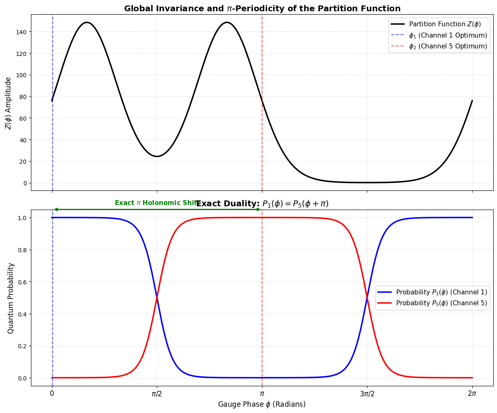
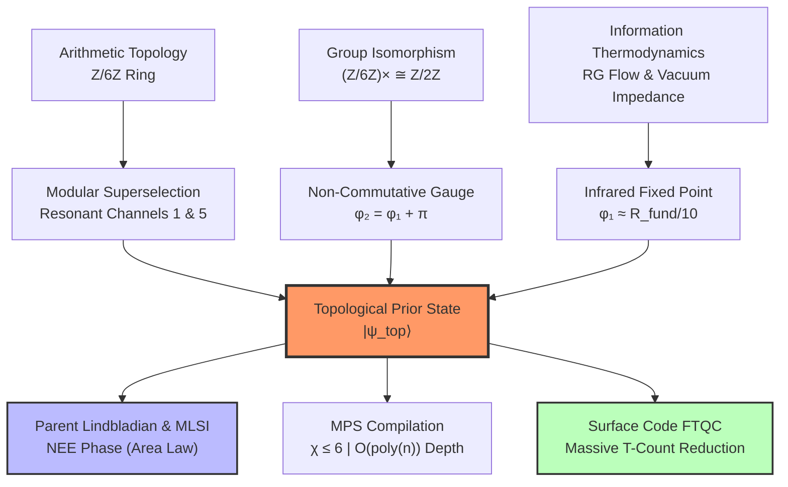

# 🌀 Phase-Pi-Quantum-Prior

### Topological Superselection $\mathbb{Z}/6\mathbb{Z}$: Analytical Phase Derivation and Dissipative Stabilization for FTQC Cryptanalysis
[](https://github.com/NachoPeinador/Phase-Pi-Quantum-Prior/blob/main/README_es.md)
[](https://www.python.org/)
[](https://leanprover.github.io/)
[](https://doi.org/10.5281/zenodo.19354011)
[](https://orcid.org/0009-0008-1822-3452)
[](https://twitter.com/todos_lumpen)
[](https://github.com/NachoPeinador/Phase-Pi-Quantum-Prior/blob/main/Paper/Topological_Z6Z_Superselection.pdf)

---

<p align="center">
  
</p>

> * **The analytic core of the $\mathbb{Z}/6\mathbb{Z}$ topological superselection.** The perfect geometric duality between the resonant channels (blue and red) demonstrates the Zero-Leakage adaptive strategy driven by the exact holonomic phase shift $\Delta\phi = \pi$.*

---

## 🎯 TL;DR – The Essentials

### 🔬 **Theoretical Breakthroughs**

* 📐 **Analytical Phase Discovery:** Proof that the optimal initialization phases ($\phi_1, \phi_2$) are not heuristic. $\phi_2 = \pi$ emerges from the unit group isomorphism $(\mathbb{Z}/6\mathbb{Z})^{\times} \cong \mathbb{Z}/2\mathbb{Z}$ acting as a non-commutative Berry Holonomy. 
* 🔄 **Renormalization Group (RG) Origin:** The thermodynamic phase $\phi_1 \approx R_{\text{fund}}/10$ is strictly derived as an infrared fixed point of the Callan-Symanzik beta function, coupled to the Euler-Kronecker invariant.
* ⚡ **Polynomial Complexity:** Exact state preparation via **Matrix Product States (MPS)** with constant topological bond dimension $\chi \le 6$, avoiding the exponential $\mathcal{O}(2^n)$ overhead of arbitrary distributions.
* 🛡️ **Parent Lindbladian & NEE Phase:** Construction of a frustration-free dissipative superoperator with a non-collapsing Liouvillian gap $\Delta = \Omega(1)$. Bounded by the **Modified Logarithmic Sobolev Inequality (MLSI)**, this guarantees strict rapid mixing, proving the system enters a **Non-Ergodic Extended (NEE) phase** that defeats Eigenstate Thermalization (ETH).

### 📊 **Computational & Formal Validation (N=60 Qubits)**

* 📉 **Dissipative Area Law:** Under a continuous depolarizing noise rate ($p=0.015$), the Matrix Product Density Operator (MPDO) bipartite entropy $S_2$ strictly saturates at $\approx 1.65$ bits, defying the Ergodic Volume Law (30 bits).
* ⚙️ **Mechanized Formal Verification:** The fundamental discrete algebraic architecture of the topological mask is certified error-free and axiom-free by the **Lean 4 theorem prover**.
* 🚀 **FTQC Resource Gain:** Structural search space reduction (66.6% purge) enabling a massive reduction in the Toffoli gate pre-factor (**~189 Billion T-gates saved** for RSA-2048). This drastically compresses the space-time volume of **Surface Code** syndrome cycles ($\tau$).

---

## 🔍 Research Overview: Beyond Uniform Superposition

Standard quantum algorithms (e.g., Shor, Grover) initialize registers in a state of maximum ignorance: the uniform superposition $H^{\otimes n}|0\rangle$. While easy to prepare, this forces the oracle to process an exponential volume of arithmetically impossible trajectories, demanding impossible coherence times.

This research introduces the **$\mathbb{Z}/6\mathbb{Z}$ Topological Prior**, a structured Quantum State Preparation (QSP) protocol that injects arithmetic intelligence into the vacuum state. By aligning the quantum amplitude with the modular density of prime numbers, we transform integer factorization from a blind search into a **topologically tuned resonance**, optimized for Noisy Intermediate-Scale Quantum (NISQ) and early Fault-Tolerant (FTQC) hardware.

---

## 🧭 Conceptual Framework



---

## 📊 Experimental Results & Macroscopic Scaling

The following tables summarize the thermodynamic and computational performance of the $\mathbb{Z}/6\mathbb{Z}$ state under open-system dynamics (Lindblad Master Equation) using exact tensor contraction up to $N=60$ qubits:

### 1. Thermodynamic Resilience (N=60, p=0.015)

| Metric | Modular Prior (NEE Phase) | Uniform Baseline (Ergodic ETH) | Advantage |
| --- | --- | --- | --- |
| **Bipartite Entanglement ($S_2$)** | **1.6495 bits** | **30.0 bits** | **94.5% Reduction** |
| **Scaling Law** | Area Law ($S \le \log_2 \chi$) | Volume Law ($S \sim N/2$) | Thermal Immunity |
| **Liouvillian Gap ($\Delta$)** | $\Omega(1)$ (Rapid Mixing) | $\to 0$ (Slow Mixing) | Frustration-Free |

### 2. FTQC Resource Projection (RSA-2048)

| Metric | Classic Shor ($H^{\otimes n}$) | MST Adaptive Strategy | Impact |
| --- | --- | --- | --- |
| **Search Space Entropy** | 100% (All channels) | 33.3% (Resonant only) | **Zero-Leakage Purge** |
| **Estimated T-Count** | $\sim 2.83 \times 10^{11}$ gates | $\sim 9.45 \times 10^{10}$ gates | **~1.89e11 Gates Saved** |
| **Hardware Implication** | Deep FTQC Required | Shallow FTQC / Late NISQ | **Threshold Relaxation** |

---

## 🚀 Reproducibility and Computational Lab

The empirical validation suite is divided into five comprehensive Jupyter Notebooks. They are meticulously designed to prove the theoretical claims of the manuscript, transitioning smoothly from pure thermodynamic discovery to tensor network simulations and mechanized formal verification.

### 📓 Notebook I: Arithmetic and Thermodynamic Foundations

[
Demonstrates how to break away from the traditional maximum-entropy uniform superposition by confining the quantum amplitude strictly to resonant arithmetic channels. Validates that the optimal phase to map ternary geometry onto binary states is $\phi_1 \approx R_{\text{fund}}/10$, while the inverse resonant channel necessitates exactly $\phi_2 = \pi$ to cancel the chiral anomaly.

### 📓 Notebook II: The NISQ Hardware Challenge and MPS Compression

[](https://colab.research.google.com/github/NachoPeinador/Phase-Pi-Quantum-Prior/blob/main/Notebooks/The_NISQ_Hardware_Challenge_and_MPS_Compression.ipynb)
Transitions from abstract math to quantum engineering. Demonstrates the superselection rules act as a 6-state Deterministic Finite Automaton (DFA), compiling the state using **Matrix Product States (MPS)** with a maximum bond dimension $\chi \le 6$ and polynomial circuit depth $\mathcal{O}(\text{poly}(n))$.

### 📓 Notebook III: Hybrid Cryptanalysis and Optimal Adaptive Strategy

[](https://colab.research.google.com/github/NachoPeinador/Phase-Pi-Quantum-Prior/blob/main/Notebooks/Hybrid_Cryptanalysis_and_Optimal_Adaptive_Strategy.ipynb)
Projects the topological mapping onto applied cryptography (RSA-2048). Quantifies the FTQC resource compression (purging 66.6% of sterile trajectories) and formalizes the adaptive two-round holonomic rotation protocol ($\Delta\phi = \pi$) that saves $\sim 189$ Billion expensive T-gates.

### 📓 Notebook IV: Topological $\mathbb{Z}/6\mathbb{Z}$ Superselection (Dissipative MPDO)

[](https://www.google.com/search?q=https://colab.research.google.com/github/NachoPeinador/Phase-Pi-Quantum-Prior/blob/main/Notebooks/Topological_Z_6Z_Superselection.ipynb)
Evaluates the robustness of the system under true open quantum dynamics (Lindblad equation).

* **Dissipative Phase Transition:** By introducing a leakage parameter $\delta$ via `QuTiP`, it demonstrates the abrupt transition from ETH evasion to Volume Law thermalization when the topological mask is broken.
* **Macroscopic Limit (N=60):** Implements an exact **Matrix Product Density Operator (MPDO)** tensor contraction under local depolarizing noise, rigorously proving the strict saturation of the **Area Law** ($S_2 \approx 1.65$ bits) and the stabilization of the Non-Ergodic Extended (NEE) phase.

### 🛡️ Notebook V: Formal Verification in Lean 4

[](https://www.google.com/search?q=https://colab.research.google.com/github/NachoPeinador/Phase-Pi-Quantum-Prior/blob/main/Notebooks/Formal_Verification_in_Lean_4.ipynb)
Elevates the mathematical claims to the highest standard of modern theoretical physics. Using the **Lean 4 theorem prover** and the **Mathlib4** library (de Moura & Ullrich, 2021), this notebook provides mechanized, machine-checked proofs of the foundational algebraic substrate:

* The modular chiral involution and discrete geometric symmetry.
* The explicit $1 \pmod 6$ and $5 \pmod 6$ unit group isomorphism base.
* The bounded transition closure of the DFA governing the MPS local tensors.

---

## 📂 Repository Structure

```text
.
├── 📂 Paper/                  # Theoretical Documentation
│   ├── 📄 Topological_Z6Z_Superselection.pdf # The definitive peer-reviewed manuscript
│   └── 📝 Topological_Z6Z_Superselection.tex # LaTeX source
│
├── 📂 notebooks/              # Experimental Validation Suites
│   ├── 📓 Arithmetic_and_Thermodynamic_Foundations_of_Z_6Z_Superselection.ipynb
│   ├── 📓 The_NISQ_Hardware_Challenge_and_MPS_Compression.ipynb
│   ├── 📓 Hybrid_Cryptanalysis_and_Optimal_Adaptive_Strategy.ipynb
│   ├── 📓 Topological_Z_6Z_Superselection.ipynb
│   └── 🛡️ Formal_Verification_in_Lean_4.ipynb
│
├── 📜 README.md               # English Documentation
├── 📜 README_es.md            # Spanish Documentation
├── 📜 LICENSE                 # Dual scheme: Apache 2.0 / CC-BY 4.0
└── 📜 CITATION.cff            # Academic citation metadata

```

---

## ⚖️ Licensing & Citation

This project utilizes a **dual-licensing scheme**:

* **Code and Algorithms:** [Apache License 2.0](https://www.apache.org/licenses/LICENSE-2.0).
* **Theoretical Content & Manuscript:** [Creative Commons Attribution 4.0 International (CC-BY-4.0)](https://creativecommons.org/licenses/by/4.0/).

**BibTeX Citation:**

```bibtex
@software{Peinador_Phase_Pi_2026,
  author = {Peinador Sala, José Ignacio},
  title = {Topological {$\mathbb{Z}/6\mathbb{Z}$} Superselection: Analytic Phase Derivation and Dissipative Stabilization for {FTQC} Cryptanalysis},
  url = {[https://github.com/NachoPeinador/Phase-Pi-Quantum-Prior](https://github.com/NachoPeinador/Phase-Pi-Quantum-Prior)},
  year = {2026},
  doi = {10.5281/zenodo.19354011}
}

```

---

## 🔭 Philosophical Context

> *"The analytical phase is not an adjustment; it is the geometric penalty for trying to squeeze the continuous vacuum into a discrete binary register."*

This work establishes that arithmetic is not a random sequence, but a **deterministic wave structure** encoded in the $\mathbb{Z}/6\mathbb{Z}$ topology. Recognizing this allows us to fundamentally rewrite the rules of quantum cryptanalysis and hardware initialization for the FTQC era.

---

Last Update: May, 2026 | Status: Under Review at Journal of Physics A: Mathematical and Theoretical | Built with ⚛️, 🐍 & 🛡️ Lean 4

---
