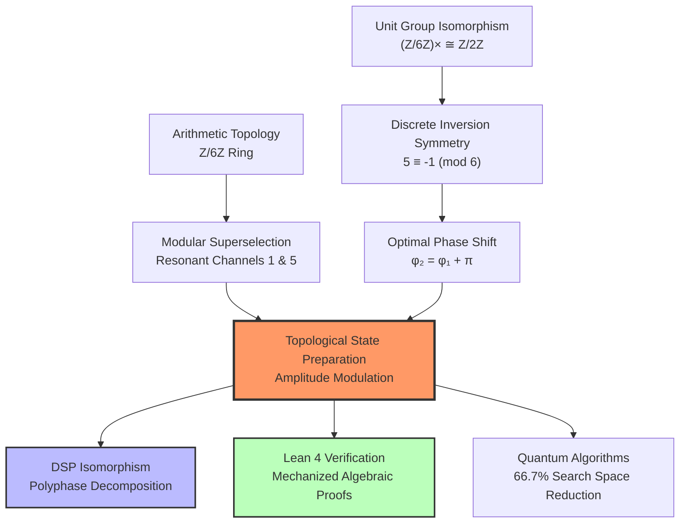

# 🌀 Phase-Pi-Quantum-Prior

### Topological State Preparation via $\mathbb{Z}/6\mathbb{Z}$ Superselection: Optimal Phases and DSP Isomorphism

---

> * **The analytic core of the $\mathbb{Z}/6\mathbb{Z}$ topological superselection.** Probability amplitude deposited in sterile channels is computationally wasted. By confining the register to the resonant channels $\mathcal{C}_1$ and $\mathcal{C}_5$ using exact phase modulations ($\phi_1 = 0$, $\phi_2 = \pi$), we achieve perfect spectral isolation isomorphic to DSP polyphase filters.*
> 
> 

---

## 🎯 TL;DR – The Essentials

### 🔬 **Theoretical Breakthroughs**

* 📐 **Analytical Phase Discovery:** Proof that the optimal initialization phases are strictly $\phi_1 = 0$ rad and $\phi_2 = \pi$ rad. This exact value is not a numerical accident but a rigorous consequence of the inversion symmetry $5 \equiv -1 \pmod{6}$ and the conservation of modular parity.
* 🎛️ **DSP Polyphase Isomorphism:** The quantum phase structure is mathematically isomorphic to the polyphase decomposition of discrete-time filters in Digital Signal Processing (DSP), guaranteeing unitary isolation, local decoupling, and perfect reconstruction.
* 🛡️ **Mechanized Formal Verification:** The fundamental discrete algebraic architecture of the ring $\mathbb{Z}/6\mathbb{Z}$ (modular involution, unit group isomorphism, and topological closure) is certified error-free and axiom-free by the **Lean 4 theorem prover**.
* 🚀 **FTQC Resource Gain:** Restricting a quantum register to the resonant channels ($\mathcal{C}_1, \mathcal{C}_5$) reduces the effective search space by ~66.7%, drastically cutting the Shannon entropy overhead from computationally sterile trajectories in arithmetic algorithms like Shor's.

---

## 🔍 Research Overview: Beyond Uniform Superposition

Standard quantum algorithms that exploit arithmetic structure rely on an initial uniform superposition over a computational basis. While optimal from a circuit complexity perspective (constant-depth Hadamard layers), this initialization forces the quantum processor to explore a vast volume of trajectories that are arithmetically irrelevant.

A fundamental theorem of elementary number theory states that every prime number $p > 3$ satisfies $p \equiv 1 \pmod{6}$ or $p \equiv 5 \pmod{6}$. This research introduces a structured Quantum State Preparation (QSP) protocol that modulates the amplitude with a sinusoidal envelope governed by a phase parameter:

$$P(x) \propto \exp\left[A \sin\left(\frac{2\pi x}{6} + \phi\right)\right] \cdot \mathds{1}_{x \equiv 1,5 \pmod{6}}$$

By determining the optimal phases to align this envelope with the discrete integer lattice, we transform arithmetic search from a high-entropy sweep into a **topologically tuned resonance**.

---

## 🧭 Conceptual Framework



---

## 📊 Experimental Results & Isomorphism

### 1. Optimal Phases from Numerical Optimization (Gain $A=5.0$)

High-precision optimization on a statevector simulation over the first $5 \times 10^4$ integers confirms the exact analytical derivation:

| Class | Optimal Phase $\phi$ [rad] | Physical Origin | Fidelity |
| --- | --- | --- | --- |
| **$\mathcal{C}_1$** | $0$ | Symmetry (no shift needed) | $>0.999$ |
| **$\mathcal{C}_5$** | $\pi \approx 3.141593$ | Inversion symmetry ($5 \equiv -1$) | $>0.999$ |

### 2. Polyphase Isomorphism Mapping

The phase structure maps directly to classical signal processing, providing a practical framework for hardware implementation:

| Modular Substrate $\mathbb{Z}/6\mathbb{Z}$ | Digital Signal Processing ($M=6$) |
| --- | --- |
| Computational basis index $ | x\rangle$ |
| Congruence class $r = x \bmod 6$ | Polyphase component $r$ |
| Resonant channels ($r=1,5$) | Signal sub-bands (passband) |
| Sterile channels ($r=0,2,3,4$) | Suppressed sub-bands (stopband) |
| Phase $\phi$ | Fractional delay in frequency domain |
| Phase shift $\Delta\phi = \pi$ | Sign inversion of conjugate sub-band |

---

## 🚀 Reproducibility and Computational Lab

The empirical and formal validation suite is divided into three comprehensive Jupyter Notebooks, meticulously designed to prove the theoretical claims of the manuscript:

### 📓 Notebook I: Amplitude Modulation and Numerical Optimization

[](https://www.google.com/search?q=https://colab.research.google.com/github/NachoPeinador/Phase-Pi-Quantum-Prior/blob/main/Notebooks/Amplitude_Modulation_Optimization.ipynb)
Implements the high-precision grid search and gradient descent on statevector simulations. Demonstrates how the probability fidelity $\mathcal{F}_r(\phi)$ converges unambiguously to $\phi_1 = 0$ and $\phi_2 = \pi$ when maximizing amplitude confinement within the resonant channels.

### 📓 Notebook II: DSP Polyphase Isomorphism & Circuit Architecture

[](https://www.google.com/search?q=https://colab.research.google.com/github/NachoPeinador/Phase-Pi-Quantum-Prior/blob/main/Notebooks/DSP_Polyphase_Isomorphism.ipynb)
Translates the algebraic phase relation into a Digital Signal Processing framework. Validates the three essential properties for NISQ/FTQC hardware: Unitary isolation (orthogonality), Local decoupling (independent polyphase preparation), and Perfect reconstruction without destructive interference.

### 🛡️ Notebook III: Formal Verification in Lean 4

[](https://www.google.com/search?q=https://colab.research.google.com/github/NachoPeinador/Phase-Pi-Quantum-Prior/blob/main/Notebooks/Formal_Verification_in_Lean_4.ipynb)
Elevates the mathematical claims to the highest standard of modern theoretical logic. Using the **Lean 4 theorem prover** and the **Mathlib4** library, this notebook provides mechanized, machine-checked proofs of the foundational algebraic substrate:

* Modular involution ($5 \equiv -1 \pmod 6$).
* Unit group isomorphism $(\mathbb{Z}/6\mathbb{Z})^{\times} \cong \mathbb{Z}/2\mathbb{Z}$.
* Topological closure of the deterministic transition rules.

---

## 📂 Repository Structure

```text
.
├── 📂 Paper/                  # Theoretical Documentation
│   ├── 📄 Zenodo_Article.pdf  # The definitive manuscript
│   └── 📝 Zenodo_Article.tex  # LaTeX source
│
├── 📂 notebooks/              # Experimental & Formal Validation Suites
│   ├── 📓 Amplitude_Modulation_Optimization.ipynb
│   ├── 📓 DSP_Polyphase_Isomorphism.ipynb
│   └── 🛡️ Formal_Verification_in_Lean_4.ipynb
│
├── 📜 README.md               # English Documentation
├── 📜 README_es.md            # Spanish Documentation
├── 📜 LICENSE                 # Dual scheme: Apache 2.0 / CC-BY 4.0
└── 📜 CITATION.cff            # Academic citation metadata

```

---

## ⚖️ Licensing & Citation

This project utilizes a **dual-licensing scheme**:

* **Code and Algorithms:** [Apache License 2.0](https://www.apache.org/licenses/LICENSE-2.0).
* **Theoretical Content & Manuscript:** [Creative Commons Attribution 4.0 International (CC-BY-4.0)](https://creativecommons.org/licenses/by/4.0/).

**BibTeX Citation:**

```bibtex
@software{Peinador_Phase_Pi_2026,
  author = {Peinador Sala, José Ignacio},
  title = {Topological {$\mathbb{Z}/6\mathbb{Z}$} Superselection: Optimal Phases and DSP Isomorphism},
  url = {https://github.com/NachoPeinador/Phase-Pi-Quantum-Prior},
  year = {2026},
  doi = {10.5281/zenodo.19354011}
}

```

---

## 🔭 Philosophical Context

> *"The result $\phi_2 = \pi$ is remarkable in its simplicity: it requires only elementary modular arithmetic and basic trigonometry, yet it provides a direct bridge between the algebraic structure of prime numbers and the phase control of quantum registers."*

This work establishes a rigorous foundation for arithmetic-aware quantum state preparation, demonstrating that algorithmic initialization can be deeply optimized before a single logical gate is applied.

---

Last Update: June, 2026 | Built with ⚛️, 🐍 & 🛡️ Lean 4
